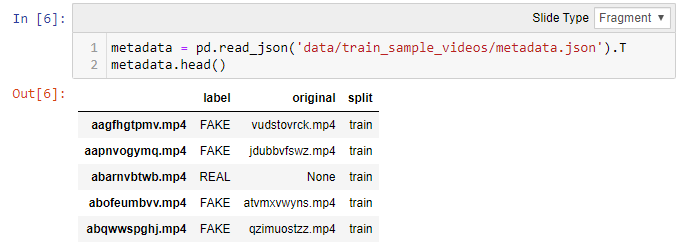
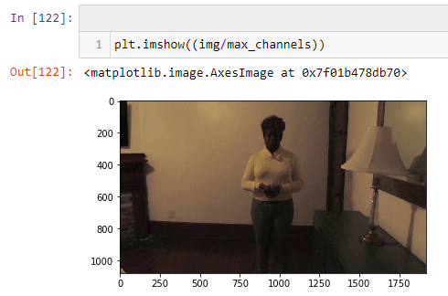
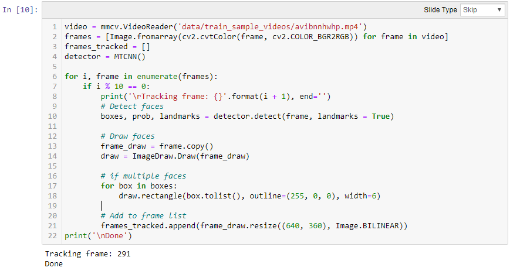
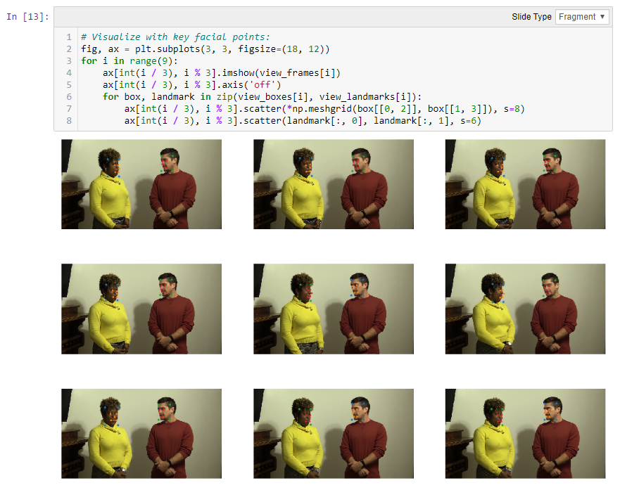
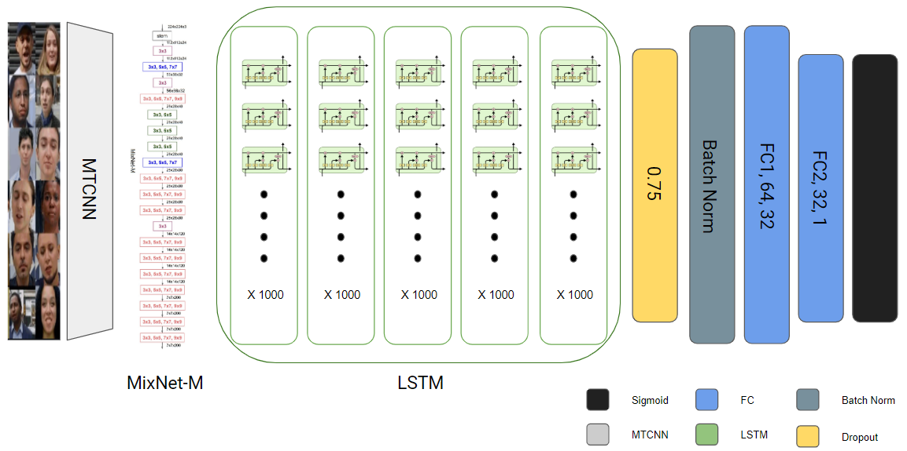
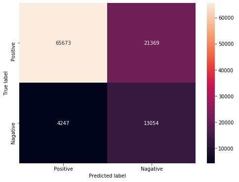
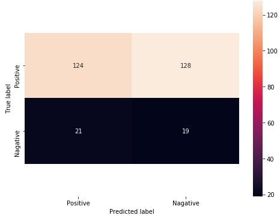

# DeepFakeChallenge
### W251 Deep Learning in the Cloud and at the Edge (Spring 2020) Final Project

## Abstract

* Participate in the Deepfake Detection Challenge (Kaggle) to predict whether or not a particular video is a deep fake
* Used IBM Cloud for pipeline
* Leveraged MTCNN, mixnet_m, LSTM, PyTorch, CUDA 10.0 for training
* Achieved an accuracy of ~ 75.45%, when predicting videos with a single face captured

## Introduction

# Deep Fake Challenge

Deepfake techniques enable a realistic AI-generated videos of people doing and saying fictional things. This technology lies within the field of computer vision, a subfield of computer science, and we have seen similar crude methods of photo manipulation (a.k.a, "photoshopping") before that somehow resembles the end results of Deepfakes. The term "deepfakes" was believed to be originated around the end of 2017 in a Reddit community r/deepfakes by a Reddit user named "deepfakes". Perhaps an example below would ring a bell.

(Amy Adams on the left, Amy Adams with Nicholas Cage's face swapped on the right)

By Source (WP:NFCC#4), Fair use, https://en.wikipedia.org/w/index.php?curid=61555724

Popularized by the various swaps of Nicholas Cage's face, the technology makes its mainstream debut in January 2018 as a proprietary desktop application called "FakeApp", which then gets superseded by Faceswap. The rising interest in DeepFake was not only supported by the amateur/commercial development efforts, but also supported by the academic institutions as a group of reserachers from University of California, Berkeley have published a paper in August 2018 that expands the application of deepfakes to an entire body.

Initial reactions to Deepfake techniques have been worriesome as these realistic fake videos have the potential to significantly impact how people determine the legitimacy of information presented online. As a result, AWS, Facebook, Microsoft, the Partnership on AI's Media Integrity Steering Committee, and academics have collaborated to launch a DeepFake Detection Challenge (DFDC) on Kaggle, in order to promote collaboration and contribute to an effort to build a robust response to the emerging threat of Deepfakes.

## Dataset

There were 4 datasets available from the DeepFake Deep Challenge on Kaggle. Among those 4 datasets, we used the Training Set to train our neural net and used the Public Validation Set to evaluate our models before submission.

* *Training Set* - Originally broken up in 50 zipped files (471.84 GB) that can be accessed through GCS bucket after accepting the competition rules.

* *Public Validation Set* - There are 400 vidoes/ids in this dataset. The submission file output for the Kaggle competition will be based on this dataset.

The data is comprised of .mp4 files, split into compressed sets of ~10GB apiece. Along with the videos, there is a metadata.json file that lists the `filename` for the videos, `label`(REAL/FAKE), `original` (filename of the original video, if the video is fake), `split` (will always be "train"). Below is an example of the metadata.json output:

   

### EDA

As an initial step, we performed an EDA on the 400 training video sample from Kaggle. Among the 400 videos, there were 323 Fake videos (80.75%) and 77 Real videos (19.25%). We can notice an uneven distribution of Fake and Real videos, which could be an issue down the road. However, we must remember that this is a small sample of a larger training dataset.

Real Video             |  Fake Video
:-------------------------:|:-------------------------:
  |  

* We noticed that some videos were too dark, we will have to apply some feature engineering to brighten the videos in our pipeline

   

   

* Each of the videos is 10 seconds long and does not exceed 300 frames.

   

### Proof of Concept / Ideation

Video detection can be thought of as a series of photo detection. As mentioned above, there are about slightly less than 300 frames per videos, and if we can capture the faces from the video frames and feed it to a neural-net, then we should be able to predict whether the video is fake or real.

Below is a quick proof of concept of taking a 10 second .mp4 file and breaking it down into multiple frames with facial keypoint detection on it.  

   

   

NOTE: cv2 and MTCNN was used for the POC above. Please refer to the EDA notebook for the full code.

## Pipeline

Now came the real challenge. We had to download the full 471.84 GB zipped file and extract/store the video files somewhere, then be able to access those video files and process them for training. In order to overcome this challenge, we decided to leverage IBM Cloud's virtual servers and Cloud Object Storage buckets, since we were familiar with the platform from our class and had ample amount of educational credit available. Below is a diagram of our pipeline:

   

   ### Workflow

   1. Download and unzip the full training file on IBM Cloud Object Storage bucket.

   2. Provision a virtual server with 2 P100s on IBM Virtual Servers.

   3. Prepare the virtual server with the following:
       * CUDA 10.0 environment
       * flash/mount external 2tb hard-drive
       * NVIDIA Docker Container with Jupyer Notebook
       * Mount IBM COS Bucket from step 1 above

   4. Process the videos on 2 GPUs (p100) by running 2 notebooks simultaneously on the IBM virtual server and store the images of cropped faces into a separate IBM COS bucket.
       * MTCNN was used for face detection
        `mtcnn = MTCNN(margin=14, keep_all=True, post_process=False, thresholds = [0.9, 0.9, 0.9], device=device).eval()`
       * We took 10 frames from each video and saved it into 2 dimensional vectors with 3 channels
       * Processing Time: From the unit testing of our pipeline, we were able to see that processing of 400 videos took about 18 minutes on a pair of P100s, which was about 22 videos per minute. Assuming that there are around 2,000 videos per folder and knowing the fact that there are 50 folders, we can expect this process to take about 100,000 / 22 = ~4,500 minutes, which translates to about 75 hours.      

   5. Access the processed videos from the second bucket
       * each video should have a size of 10 (frames), 3 channels (RGB), 160 (height), 160 (width)

   6. Create/Define the model
       * Use `DataLoader` from `torch.utils.data` to prepare your training set and validation set
       * Use PyTorch modules:
               - `torch.nn`
               - `torch.optim`
               - `torch.utils`
       * Allow the model to adjust the parameters of `mixnet_m`

   7. Train/Evalute the model
       * Feel free to experiment and find the best model parameters to achieve the desired score
       * Use `sklearn.metrics` to easily calculate the accuracy, precision, recall, and more
       * Save the models using PyTorch modules

   8. Submit your model
       * Run the `3-Submission.ipynb` notebook with your model parameters to generate Kaggle submission output
       * Model will be validated against the Kaggle Test dataset

## Model Architecture

Adam Optimizer was used.

* refer to `DFDCNet()` in the `2-Model-1face.ipynb` notebook for implementation

## Evaluation

Above was the submission requirement from the Kaggle competition. We are calculating the Log Loss by using the `torch.nn.BCELoss`

The use of log provides extreme punishments for being both confident and wrong.

## Conclusion

In order to better evalute our model's performance, we plotted a confusion matrix for each face category.

   ### Single Face Prediction

   These were the cases when the mixnet captured a single face from the frames. Among the 104,343 video files of a single face, our model was able to correctly predict 78,727 videos out of 104,343 videos (~75.45%), while getting 25,616 videos wrong. Among the 25,616 videos, there were 21,369 videos that were incorrectly predicted as False, while 4,247 videos were incorrectly predicted as True.

   In a more scientific term, our model's accuracy was 0.754502, with a precision of 0.754498, and a recall of 0.939259.

   

   ### Double Face Prediction

   These were the cases when the mixnet captured two faces from the frames. Although our dataset was predominantly single face featuring videos, our model was able to score an accuracy of 0.582447, a precision of 0.582612, and a recall of 0.891579.

   

   ### Triple Face Prediction

   These were the cases when the mixnet captured thre faces from the frames. Our model was able to score an accuracy of 0.489726, a precision of 0.492063, and a recall of 0.855172

   

Due to the uneven distribution of number of faces present in the dataset's video files, we can notice an obvious trend of our model's performance. In general, our model had bad performance on prediction of videos that had multiple faces in the video files. This can be attributed to the lack of training examples for the multiple face scenarios. However, it makes us wonder if our model is decent enough to be deployed, with the assumption that most fake videos will be produced from video files with a single face, because there are added costs and complexity to manipulating multiple faces.

   ### Next Steps

   Although the competition is over, the need for a robust response for the emerging threat of DeepFakes are not over yet. There are multiple things we can do to improve our model. Below are some next steps that we believe are worth investing time in:

   * Increasing the processing power to accommodate more frames per each videos
   * Try different model structures and hyper-parameters
   * Augment the training data by shuffling the frames for Real videos. There were significantly more Fake videos than Real videos. We believe that this uneven distribution might have influenced the results of our model. Perhaps increasing the # of Real videos by shuffling frames would better help with the observed uneven distribution of labels in our dataset
   * Improve facial recognition quality (There were times when the model incorrectly identified objects as faces. Some were tough like an actual face inside a person's t-shirt)

## References
